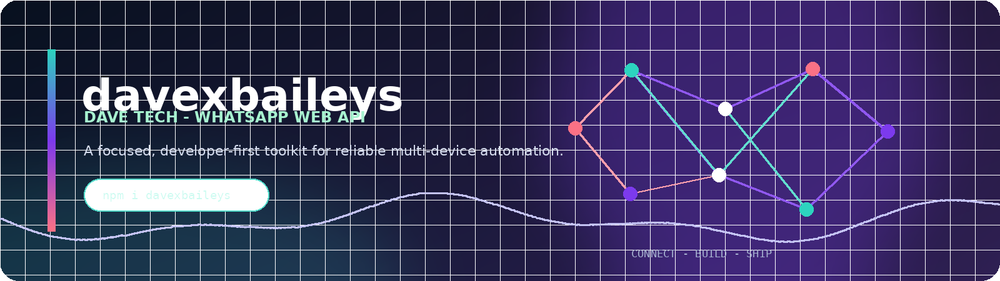

<p align="center">
  
</p>

<div align="center">
  <a href="https://www.npmjs.com/package/davexbaileys"></a>
  <a href="https://www.npmjs.com/package/davexbaileys"></a>
  <a href="LICENSE"></a>
  <a href="https://github.com/Davex-254/davexbaileys"></a>
</div>

> **davexbaileys** is the Dave Tech-maintained WhatsApp Web API toolkit for developers who need reliable multi-device automation, LID identity resolution, interactive messaging, channel tools, and a practical extension surface.

> **Official foundation:** davexbaileys acknowledges the open-source Baileys project maintained by [WhiskeySockets](https://github.com/WhiskeySockets/Baileys). This project is an independent Dave Tech distribution and is not affiliated with WhatsApp LLC.

## What is in the current package

The documentation below is written from the current `src/` implementation and its public exports. It focuses on APIs that are present in the current tree and keeps the examples aligned with the runtime implementation.

| Area | Current public surface |
|---|---|
| Core socket | `makeWASocket` as the default export and named export |
| Authentication and protocol utilities | Re-exports from `Utils`, `Types`, `Defaults`, `WABinary`, `WAM`, and `WAUSync` |
| Chats and groups | Chat, group, community, and business socket layers composed into the main socket |
| Interoperability | `makeInteropSocket` and its associated public methods |
| Newsletter/channel tools | `newsletterFollow`, `newsletterUnfollow`, metadata, creation, messaging, and related helpers |
| Usernames | Username lookup and management methods exposed by the username socket layer |
| LID support | `LIDMappingStore`, `UsyncLIDProtocol`, and related mapping utilities |
| Rich messaging | `AIRich`, `Button`, `ButtonV2`, `Carousel`, and `Toolkit` |
| Group status | `ToxicHandler` and the `toxicHandler` socket surface retained as current API names |

## Install

```bash
npm install davexbaileys
```

To pin the corrected release explicitly:

```bash
npm install davexbaileys@2.5.26
```

For the repository version on GitHub:

```bash
npm install github:Davex-254/davexbaileys
```

| Source | Install command | Recommended use |
|---|---|---|
| npm latest | `npm install davexbaileys` | Standard bot installations that should follow the latest published release |
| npm pinned | `npm install davexbaileys@2.5.26` | Deployments that need a reproducible package version |
| GitHub | `npm install github:Davex-254/davexbaileys` | Testing the current repository commit before an npm release |

Each npm command adds `davexbaileys` to the bot project’s `package.json`; application code can then import the package as shown in the Quick start example below.

## Quick start

```js
import makeWASocket, {
  fetchLatestBaileysVersion,
  useMultiFileAuthState,
} from 'davexbaileys'

const { state, saveCreds } = await useMultiFileAuthState('./auth')
const { version } = await fetchLatestBaileysVersion()

const sock = makeWASocket({
  version,
  auth: state,
})

sock.ev.on('creds.update', saveCreds)
sock.ev.on('connection.update', ({ connection, lastDisconnect }) => {
  console.log('connection:', connection, lastDisconnect?.error)
})
```

`makeWASocket` is both the default export and a named export. The main socket composes the current chat, group, community, business, message, newsletter, username, and interoperability layers.

## Public exports

The current top-level source exports the following builder classes and aliases:

```js
import makeWASocket, {
  AIRich,
  Button,
  ButtonV2,
  Carousel,
  Toolkit,
  ToxicHandler,
  // aliases exported by the current source:
  RichMessage,
  Rich,
  RichMsg,
  RichAI,
  Buttons,
  Btns,
  ButtonsV2,
  BtnsV2,
  NewButtons,
} from 'davexbaileys'
```

`Button` is also available as `Buttons` and `Btns`. `ButtonV2` is also available as `ButtonsV2`, `BtnsV2`, and `NewButtons`. The aliases point to the same builder classes; choose the spelling that best fits an existing application.

## Button builders

The current source contains two button implementations with different payload formats. Use `Button` for native-flow interactive messages and its helper methods. Use `ButtonV2` for the `buttonsMessage` payload format. Both builders require a socket client in their constructor and expose shared chainable methods such as `setTitle`, `setSubtitle`, `setBody`, `setFooter`, `setContextInfo`, and `addPayload`.

### `Button`: native-flow interactive messages

`Button` builds an `interactiveMessage` whose `nativeFlowMessage` contains `messageParamsJson` and a list of named buttons. The builder sends through the socket client’s `relayMessage` method and adds the native-flow relay nodes used by the current implementation.

```js
import { Button } from 'davexbaileys'

const jid = recipientJid // e.g. a user JID supplied by your application

const message = new Button(sock)
  .setTitle('Dave Tech actions')
  .setSubtitle('davexbaileys')
  .setBody('Choose one action below.')
  .setFooter('Powered by Dave Tech')
  .addReply('View profile', 'view_profile')
  .addUrl('Open repository', 'https://github.com/Davex-254/davexbaileys')
  .addCopy('Copy package name', 'davexbaileys')

await message.send(jid)
```

The implemented convenience methods are:

| Method | Current payload purpose |
|---|---|
| `addReply(displayText, id, options)` | Adds a `quick_reply` button |
| `addUrl(displayText, url, webviewInteraction, options)` | Adds a `cta_url` button |
| `addCopy(displayText, copyCode, options)` | Adds a `cta_copy` button |
| `addCall(displayText, id, options)` | Adds a `cta_call` button |
| `addReminder(displayText, id, options)` | Adds a `cta_reminder` button |
| `addCancelReminder(displayText, id, options)` | Adds a `cta_cancel_reminder` button |
| `addAddress(displayText, id, options)` | Adds an `address_message` button |
| `addLocation(options)` | Adds a `send_location` button |
| `addButton(name, params)` / `setButton(name, params)` | Adds a custom named button with an object or JSON string payload |
| `setParams(object)` | Sets the native-flow `messageParamsJson` object |
| `clearButtons()` | Removes all buttons currently in the builder |

The selection-list helpers create a `single_select` button and then append sections and rows:

```js
const picker = new Button(sock)
  .setTitle('Choose a plan')
  .setBody('Select the plan you want to view.')
  .setFooter('Dave Tech')
  .addSelection('Plans')
  .makeSection('Available plans', 'davexbaileys')
  .makeRow('Starter', 'Starter plan', 'For testing', 'plan_starter')
  .makeRow('Pro', 'Production plan', 'For deployed bots', 'plan_pro')

await picker.send(jid)
```

`makeSection` and `makeRow` require a selection to have been created first. The builder also supports media and location headers through `setImage`, `setVideo`, `setDocument`, `setMedia`, and `setLocation`.

### `ButtonV2`: buttons-message payloads

`ButtonV2` produces a `buttonsMessage` with `contentText`, `footerText`, optional media/location data, `viewOnce: true`, and the button objects collected by the builder. It requires at least one button before `send` is called.

```js
import { ButtonV2 } from 'davexbaileys'

const message = new ButtonV2(sock)
  .setTitle('Confirm action')
  .setBody('Do you want to continue?')
  .setFooter('Dave Tech')
  .addButton('Continue', 'continue')
  .addButton('Cancel', 'cancel')

await message.send(jid)
```

For full control, `addRawButton(object)` appends a raw button object. `setThumbnail(path)` accepts a URL or buffer, while `setMedia(object)` accepts the media object used by the current message builder.

### `Carousel`: media cards

`Carousel` wraps cards into an `interactiveMessage.carouselMessage`. Each card must already have a media-bearing header; the implementation rejects cards whose header does not set `hasMediaAttachment`.

```js
import { Button, Carousel } from 'davexbaileys'

const firstCard = await new Button(sock)
  .setTitle('First card')
  .setBody('A card with an image header.')
  .setImage('https://example.com/first.jpg')
  .toCard()

const secondCard = await new Button(sock)
  .setTitle('Second card')
  .setBody('A second media card.')
  .setImage('https://example.com/second.jpg')
  .toCard()

await new Carousel(sock)
  .setBody('Choose a card')
  .setFooter('davexbaileys')
  .addCard([firstCard, secondCard])
  .send(jid)
```

### Building without sending

All three builders expose `build(jid, options)` for generating the WhatsApp message object without immediately relaying it. Use `send(jid, options)` when the builder should relay the message through the socket. The `run` methods are compatibility wrappers around `send`.

## Rich messages and utilities

The current source exports `AIRich` and the aliases `RichMessage`, `Rich`, `RichMsg`, and `RichAI`. It also exports `Toolkit` for utility operations used by the builders, including media conversion, resizing, buffer fetching, promise handling, and inline-entity processing.

```js
import { AIRich, Toolkit } from 'davexbaileys'

const rich = new AIRich(sock)
  .setBody('Read more at https://example.com')
  .setFooter('Dave Tech')

const output = await rich.build(jid)
const resized = await Toolkit.resize(buffer, 300, 300)
```

Use the source exports as the authority for the available rich-message methods. The README intentionally does not list methods that are not present in the current builder implementation.

## Newsletter and channel tools

The current newsletter socket exposes explicit channel operations, including follow, unfollow, metadata, creation, mute/unmute, and message sending. A follow request is made only when the application calls the public method:

```js
await sock.newsletterFollow('1234567890@newsletter')
await sock.newsletterUnfollow('1234567890@newsletter')

const metadata = await sock.newsletterMetadata('invite', 'your-invite-link')
console.log(metadata)
```

The public `newsletterId()` helper normalizes channel identifiers and invite-link forms when the application needs a clean newsletter ID.

## LID mapping, groups, and protocol modules

The current source exports the LID, binary, protocol, and synchronization modules from the top-level package. The socket composition includes group, community, business, chat, username, message, newsletter, and interoperability layers. Application code can use the composed `makeWASocket` surface or import the underlying public utilities when it needs lower-level control.

The current source also exports `ToxicHandler` and exposes `toxicHandler` on the socket. Those names are retained as API compatibility names because they are present in the current implementation; they are not used as the project’s branding.

## Contact and support

For project support, open an issue in the [davexbaileys repository](https://github.com/Davex-254/davexbaileys/issues). Direct WhatsApp contact is available through the badge below.

<div align="center">
  
  
  
  <br /><br />
  <strong>davexbaileys</strong> - maintained by <strong>Dave Tech</strong><br />
  <a href="https://wa.me/254111687009"></a> ·
  <a href="https://github.com/Davex-254/davexbaileys">GitHub</a> ·
  <a href="https://www.npmjs.com/package/davexbaileys">npm</a>
</div>

## License

MIT License. See [LICENSE](LICENSE) for the current project license and copyright notice.

The project acknowledges the official [Baileys project by WhiskeySockets](https://github.com/WhiskeySockets/Baileys) as part of the open-source WhatsApp Web API ecosystem. davexbaileys is maintained independently by Dave Tech and is not affiliated with WhatsApp LLC.
